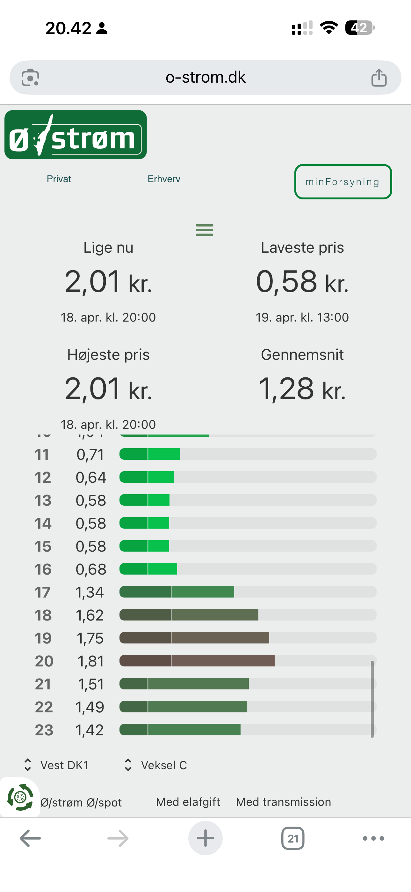
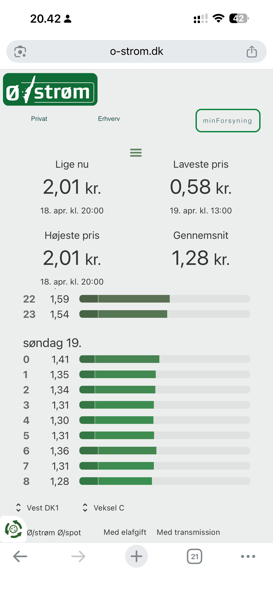
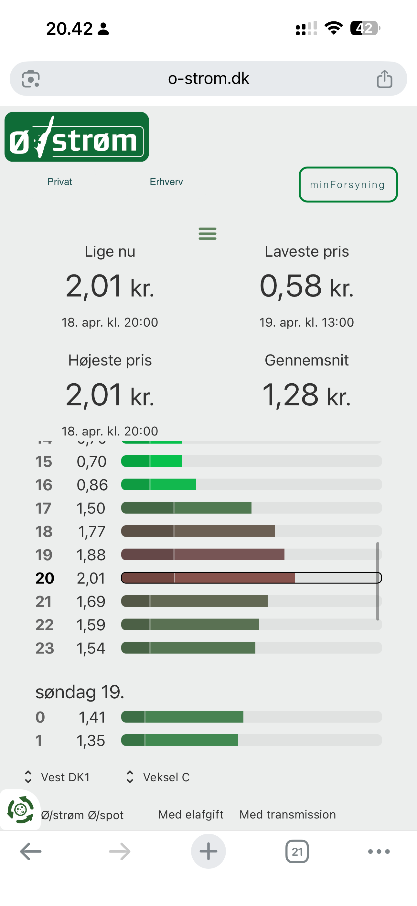
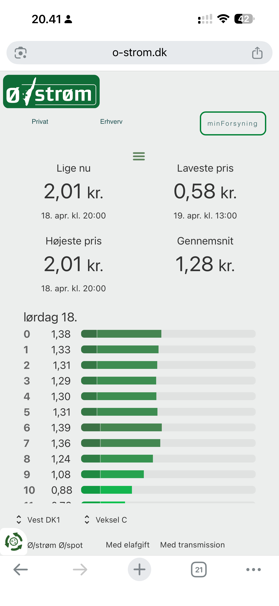

# HA Elpriser

En simpel Home Assistant custom integration, der henter spotpriser fra Energy-Charts og viser:

- aktuel elpris
- de naeste 24 timers timepriser i DKK/kWh
- en 7-dages prisprognose markeret som estimat

## HACS

Repoet er gjort klar til HACS som custom repository.

Naar repoet ligger offentligt paa GitHub, kan du installere det saadan:

1. Aabn HACS i Home Assistant.
2. Tryk paa menuen med de tre prikker.
3. Vaelg `Custom repositories`.
4. Indsaet GitHub-URL'en til repoet.
5. Vaelg typen `Integration`.
6. Installer `HA Elpriser`.
7. Genstart Home Assistant.

## Funktioner

Integrationen bruger `https://api.energy-charts.info/price` til faktiske day-ahead spotpriser.

Priserne bliver omregnet fra `EUR/MWh` til `DKK/kWh` med en fast kurs paa `7.46`.

De viste priser er kun spotpris og inkluderer ikke nettarif, afgifter eller moms.

Energy-Charts udstiller ikke en officiel 7-dages prisprognose i samme endpoint, saa denne integration beregner i stedet et estimat ud fra de seneste 28 dages historiske priser med match paa ugedag og klokkeslaet. Prognosen skal derfor ses som vejledende, ikke som en markedspris.

## Installation

Hvis du ikke bruger HACS endnu:

1. Kopier `custom_components/elpriser` til din Home Assistant `custom_components` mappe.
2. Genstart Home Assistant.
3. Tilfoej dette til `configuration.yaml`:

```yaml
sensor:
  - platform: elpriser
    name: Elpriser
    bidding_zone: DK1
    forecast_days: 7
```

## Entiteter

Integrationen opretter to sensorer:

- `sensor.elpriser_nuvaerende_elpris`
- `sensor.elpriser_elpris_ugeprognose`

Den foerste sensor har attributter med `prices_next_24h`, `cheapest_hour` og `most_expensive_hour`.

Den anden sensor har attributter med `forecast_hourly`, `forecast_daily` og `forecast_method`.

## Diagram i Lovelace

Det pæneste resultat faar du med `ApexCharts Card`, som kan installeres via HACS:

- <https://github.com/RomRider/apexcharts-card>

Naar kortet er installeret, kan du bruge dette eksempel i et manuelt dashboard-kort. Det viser kendte priser i groent, prognoser i orange og viser vaerdierne i `oere/kWh`:

```yaml
type: custom:apexcharts-card
graph_span: 168h
span:
  start: hour
header:
  show: true
  title: Elpriser pr. time
  show_states: true
  colorize_states: true
now:
  show: true
  color: '#b45309'
apex_config:
  chart:
    height: 650
    zoom:
      enabled: true
    toolbar:
      show: true
      tools:
        zoom: true
        zoomin: true
        zoomout: true
        pan: true
        reset: true
  legend:
    show: true
    position: top
  plotOptions:
    bar:
      columnWidth: 75%
  stroke:
    width: 0
  grid:
    padding:
      bottom: 30
  xaxis:
    type: datetime
    labels:
      datetimeUTC: false
      datetimeFormatter:
        year: 'dd MMM yyyy'
        month: 'dd MMM'
        day: 'dd MMM'
        hour: 'HH:mm'
      style:
        fontSize: 12px
    axisBorder:
      show: true
    axisTicks:
      show: true
  yaxis:
    decimalsInFloat: 0
    title:
      text: 'oere/kWh'
series:
  - entity: sensor.nuvaerende_elpris
    name: Kendte priser
    type: column
    color: '#16a34a'
    unit: oere/kWh
    float_precision: 1
    data_generator: |
      return (entity.attributes.prices_next_24h || []).map((item) => {
        return [new Date(item.start).getTime(), item.price_dkk_kwh * 100];
      });

  - entity: sensor.elpris_ugeprognose
    name: Prognose
    type: column
    color: '#f59e0b'
    unit: oere/kWh
    float_precision: 1
    data_generator: |
      const known = new Set(
        (hass.states['sensor.nuvaerende_elpris']?.attributes?.prices_next_24h || [])
          .map((item) => new Date(item.start).getTime())
      );

      return (entity.attributes.forecast_hourly || [])
        .slice(0, 168)
        .filter((item) => !known.has(new Date(item.start).getTime()))
        .map((item) => {
          return [new Date(item.start).getTime(), item.price_dkk_kwh * 100];
        });
```

## Mobilvenligt Lovelace-kort

Der ligger også en mere mobilvenlig visning inspireret af de viste referencebilleder. YAML-filen findes her:

- `docs/lovelace/mobile_price_overview.yaml`

Den bruger `custom:button-card` og viser:

- `Lige nu`
- `Laveste pris`
- `Højeste pris`
- `Gennemsnit`
- `Næste 24 timer` som scrollbar liste
- `Prognose næste 48 timer` som separat sektion

Referencebillederne er lagt i repoet her:






## Stoettede budzoner

Alle budzoner som Energy-Charts understoetter i `/price`, fx `DK1`, `DK2`, `DE-LU`, `SE4` og `NO2`.

## Kilde

- Energy-Charts API: <https://api.energy-charts.info/>

## GitHub

Repoet er sat op til:

- <https://github.com/erath0r/HA_Elpriser>
